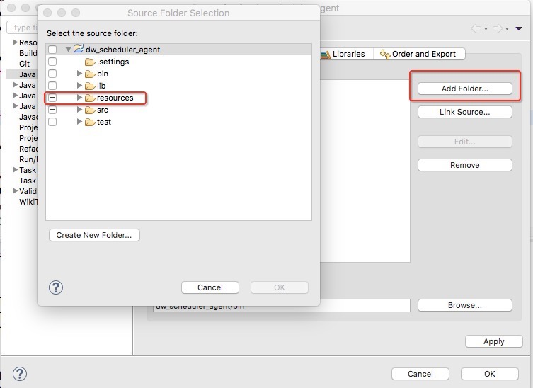
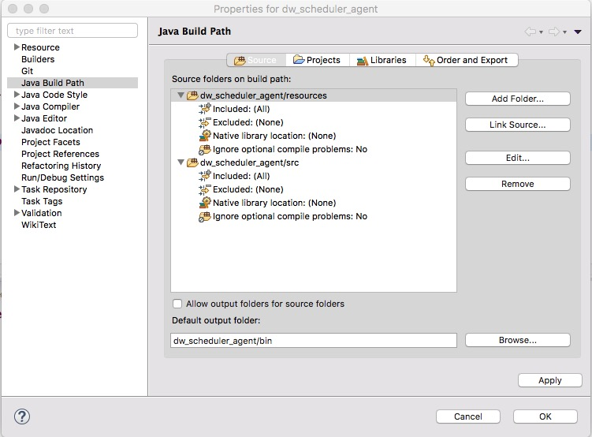
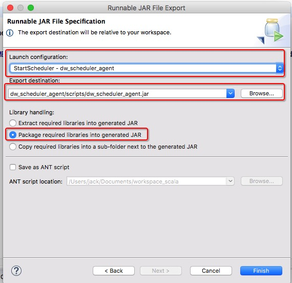

# dw_scheduler_agent DW 调度服务

## 介绍

- 负责调度数据部的基础 etl 脚本、HQL 存储过程等

## 基本工作原理

依赖
 - Zookeeper 分布式锁
 - Mysql 服务

```
通过 java 启动进程后

1.连接 zookeeper 分布式锁

2.建立守护进程，开 TCP 端口号 39800 监听

3.通过轮训监听 mysql 调度表的状态
发现数据中有 quarz 匹配的通过任务
使用 scheduler_runner.py 脚本统一调度服务

```

## 开发环境搭建以及注意事项

### 1.创建 zookeeper 节点 (一般已经创建好，不需要操作此步骤)

``` sh
在 zookeeper 客户端创建如下节点

create /dw_scheduler "DW_scheduler"
create /dw_scheduler/scheduler_servers "部署调度Agent的服务器"
create /dw_scheduler/locks "调度系统分布式启动锁"
create /dw_scheduler/testlocks "调度系统Test分布式启动锁"

```

### 2.环境搭建

``` sh
1. 创建工作目录
  mkdir ~/app
  cd ~/app

2. 克隆最新代码到本地
  dw_scheduler_agent 所在仓库
  git clone git@git.corp.angejia.com:dw/dw_scheduler_agent.git

  项目公共配置文件仓库
  git clone git@git.corp.angejia.com:dw/conf.git 克隆配置文件仓库
  cd ~/app/conf  
  git fetch origin develop 切换到 develop 分支，以此分支作为配置环境


3. 因为代码本身不放配置文件，所以要导入 conf 仓库的配置文件

  1) ~/.bashrc 配置环境变量

    # APP PATH
    export ANGEJIA_APP_PATH=~/app
    export DW_CONF=$ANGEJIA_APP_PATH/conf
    export DW_SCHEDULER_AGENT_HOME=$ANGEJIA_APP_PATH/dw_scheduler_agent

  2) 配置 conf 仓库
    conf 仓库有 2 个分支，分别是 master 线上分支，和 develop 开发分支，分别放了线上和线下的配置参数, 软链配置目录

    ln -s $DW_CONF/dw_scheduler_agent/resources $DW_SCHEDULER_AGENT_HOME/resources


4. Eclipse 创建项目
  按照  "Eclipse 配置参考" Link Source 到本项目中, 详见 "Eclipse 配置参考"


5. 运行

  调用 main 入口方法 com.ajk.dw.scheduler.StartScheduler, 打成 run jar 包，放在 $DW_SCHEDULER_AGENT_HOME/scripts/dw_scheduler_agent.jar

  * 选择一个运行方式, 需要指定环境变量 DW_SCHEDULER_AGENT_HOME(项目部署目录)

  1) 指定配置运行
    java -DAPP_NAME=dw_scheduler_agent -Dfile.encoding=utf-8 -DDW_SCHEDULER_AGENT_HOME=$DW_SCHEDULER_AGENT_HOME -jar $DW_SCHEDULER_AGENT_HOME/scripts/dw_scheduler_agent.jar

  2) 使用系统环境运行
    java -DAPP_NAME=dw_scheduler_agent -Dfile.encoding=utf-8 -jar $DW_SCHEDULER_AGENT_HOME/scripts/dw_scheduler_agent.jar


6. 部署
   1) 上传到 dwtest 测试环境
    scp $DW_SCHEDULER_AGENT_HOME/scripts/dw_scheduler_agent.jar hadoop@dwtest:/home/hadoop/app/dw_scheduler_agent/scripts/

   2) 上传到 bi3 线上环境
    scp $DW_SCHEDULER_AGENT_HOME/scripts/dw_scheduler_agent.jar dwadmin@bi0:/home/dwadmin/bi_server_dir/bi3/data/app/dw_scheduler_agent/scripts/

   3) 启动脚本
    $DW_SCHEDULER_AGENT_HOME/scripts/scheduler_restart.sh

   4）监控日志 (根据配置文件路径决定)
    tail -f /data/log/dwlogs/schedule_log/schedule_info.log

   5) 查看是否启动
    netstat -tunlp | grep 39800

```


## Eclipse 配置参考

### 图 1


### 图 2



### 编译打包

