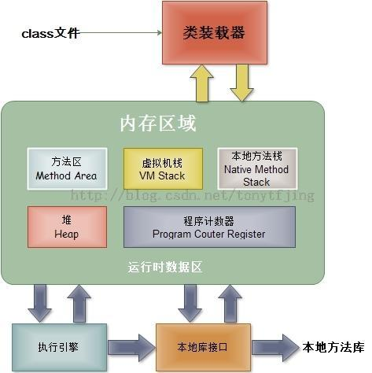
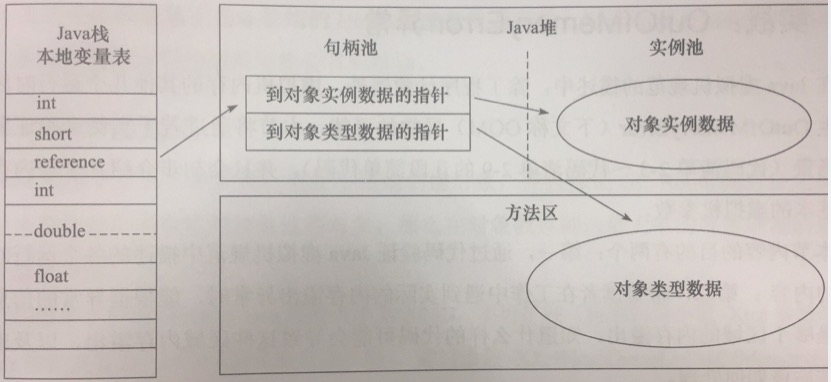
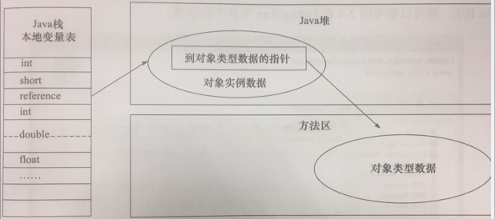

# JVM Doc

## 一、JVM 运行内存布局



### 1. 程序计数器 Program Counter Register (线程私有内存)

- 程序计数器
  - 是一块较小的内存区域，是当前线程所执行的<字节码的行号>指示器。

- Java 虚拟机的多线程是通过线程轮流切换, 并分配处理器执行时间的方式来实现的。

- 为了线程切换后能恢复到正确的执行位置, 每条线程都需要一个独立的程序计数器，各条线程之间计数器互补影响，独立存储，这类的内存叫做: 线程私有内存。

- 此内存区域是唯一不会出现 OutOfMemoryError 情况的内存


### 2. 虚拟机栈 VM Stack (线程私有内存)

- VM Stack 的生命周期与线程相同, VM Stack 也是线程私有

- VM Stack 用来描述 Java 方法执行的内存模型：
  - 每个方法在执行的同时会创建一个栈帧(Stack Frame)

- 栈帧(Stack Frame)：
  - 用于存储 <局部变量、操作数栈、动态链接、方法出口>, 每个方法从调用到执行完成的过程，就是对应一个栈帧(Stack Frame)在虚拟机中入栈到出栈的过程。

- 这个区域会有两种异常:
  - StackOverFlowError: 线程请求的深度大于虚拟机允许的深度。
  - OutOfMemoryError: 虚拟机栈 VM Stack 需要动态扩展内存大小，无法申请到足够的内存时会出现


### 3. 本地方法栈 Native Method Stack (线程私有内存)

- 本地方法栈与虚拟机栈作用类似，区别是：
  - 虚拟机栈 VM Stack: 是为虚拟机执行 Java 方法。 本地方法栈 Native Method Stack: 是为虚拟机使用到的本地方法(Native) 准备的，本地方法栈对使用的语言、数据结构没有明显

- 这个区域会有两种异常(与虚拟机栈 VM Stack 相似):
  - StackOverFlowError: 线程请求的深度大于虚拟机允许的深度。
  - OutOfMemoryError: 虚拟机栈 VM Stack 需要动态扩展内存大小，无法申请到足够的内存时会出现


### 4. Java 堆 Heap (线程共享内存)

Java 堆是虚拟机中内存管理的最大一块区域，被所有线程共享，在虚拟机启动的时候创建。堆唯一的目的是存放对象实例、分配的数组

Java 堆可以细分为:
- 新生代 Young Generation 区
  - Eden Space 任何新进入运行时数据区域的实例都会存放在此
  - S0 Suvivor Space 存在时间较长，经过垃圾回收没有被清除的实例，就从Eden 搬到了S0
  - S1 Survivor Space 同理，存在时间更长的实例，就从S0 搬到了S1

- 旧生代 Old Generation/tenured 区
  - 存在时间更长的实例，对象多次回收没被清除，就从S1 搬到了 tenured

- Perm 永久代存放运行时数据区的方法区

这个区域内存不足会抛出: OutOfMemoryError 异常


### 5. 方法区 Method Area (线程共享内存)

方法区 Method Area 是各个线程共享的内存区域, 存储已经被虚拟机加载的 Class 信息(字段,方法,接口等)、常量、静态变量、即使编译后的代码数据。

这个区域内存不足会抛出: OutOfMemoryError 异常


### 5.1. 运行时常量池 Runtime Constant Pool 也是 方法区 Method Area 的一部分 (属于方法区 Method Area 规则)

存放编译期间生成的各种<字面量>和<符号引用>, 这部分数据将在类加载后进入 <方法区的运行时常量池> 中存放

这个区域内存不足会抛出: OutOfMemoryError 异常


### 6. 直接内存 Direct Memory

直接内存 Direct Memory 不是 JVM 运行时内存的一部分，而是 JDK 1.4 中新加入的 NIO(New Input/Output) 类, 引入了基于通道(Channel) 与 缓冲区(Buffle) 的 I/O 方式。
这种方式可以使用 本地(Native) 函数库直接在堆外分配内存，通过一个存储在 Java 堆中的 DirectByteBuffer 对象, 作为这块堆外内存的引用，这样就避免了 Java 堆和 Native 堆来回复制数据.

直接内存分配的堆外内存会受到物理机和操作系统的内存限制, 如果动态扩展不足会出现: OutOfMemoryError 异常


## 二、HotSpot 虚拟机对象

### 1.  HotSpot 虚拟机中对象创建、对象指针原子性

**创建对象**:

分配内存的时候，会把确定大小的内存从 Java 堆中划分出来，在分配对象内存的时候会有两种算法, 具体使用哪种由 Java 虚拟机决定：

- 指针碰撞
  - 把指针从堆的空闲空间, 挪动一段与对象大小相同的距离, 这样做的前提是 Java 堆中的内存是规整的
- 空闲列表
  - 虚拟机维护一个<列表>，记录内存块中可用的区域，在分配内存的时候从<列表>中查找可用的区域分配给对象，并且更新<列表>


**对象指针原子性**:

分配对象在虚拟机中非常频繁, 多并发的场景中，指针的修改被多个对象操作不是线程安全，为了解决这个问题有如下 2 个方法

- 内存分配空间的动作: 进行同步处理（默认）
  - 虚拟机采用的是 CAS 配上失败重试的方法保证更新操作的原子性
- 内存分配空间的动作: 按照线程划分到不同的空间进行
  - 每个线程在 Java 堆中预先分配一小块内存，叫做本地线程分配缓存 TLAB (Thread Local Allocation Buffer)
  - 哪个线程需要分配内存，就在哪个线程的 TLAB 上进行, 每当哪个线程的 TLAB 空间用光，会分配新的 TLAB，并且同步锁定住
  - 开启 TLAB : -XX:+/-UseTLAB


### 2. HotSpot 虚拟机中的对象布局

HotSpot 虚拟机中，对象有 3 个区域:  对象头、实例数据、对齐填充

- 第一区域: 对象头(Header): 由 2 个部分组成
  - 第一部分: 存储对象自身的运行时的数据, 官方称为 <MarkWord>
    - 对象哈希码
    - 对象GC分代年龄
    - 锁状态标志
    - 线程持有的锁
    - 偏向线程 ID
    - 偏向时间戳
  - 第二部分: 类型指针
    - 对象指向它的类元数据的指针, 虚拟机通过这个指针来确定这个对象是哪个类的实例
- 第二区域: 实例数据(Instance Data)
  - 对象中存储的字段类型、父类字段类型
  - longs/doubles、ints、shorts/chars、bytes/booleans、opps 相同宽度的字段类型会被分配到一起
- 第三区域: 对齐填充(Padding)
  - 启到占位符的作用


### 3. HotSpot 虚拟机中对象的访问定位

对象的访问定位: Java 程序通过<栈上的引用数据操>作堆中的具体对象, 目前主要有两种方法

- 句柄访问
  - Java 堆中将会划分出一块内存来作为<句柄池>，引用中存储对象的<句柄地址>，而句柄中包含了<对象实例数据与类型数据>各自的具体地址
  - 优点: 使用句柄的好处是引用中存储的是稳定的句柄地址，在对象被移动（垃圾回收导致对象的移动）时只会改变句柄重的实例数据指针
  - 

- 直接指针访问
  - 栈中的引用直接指向对象在堆中的地址，对象在头数据中指向方法区中其类元数据的地址。
  - 优点: 使用直接指针访问的好处是速度更快
  - 


### 4. OutOfMemoryError 内存溢出异常区域

- Java 堆溢出: Java 堆用于存储对象实例，只要不断的创建对象就有可能存在内存溢出, 但是要确认是哪种情况 (OutOfMemoryError)
  - 内出泄露: GC 收集器无法自动回收它们, 通过 GC Roots 的引用链定位问题
  - 内存溢出: 对象必须正常活着, 检查 -Xmx 和 -Xms 是否可以调大

- 虚拟机栈和本地方法栈溢出: 虚拟机栈、本地方法栈
  - StackOverflowError 异常: 如果线程请求的栈深度大于虚拟机所允许的最大深度
  - OutOfMemoryError 异常: 在单线程下，无论由于<栈帧>太大还是<虚拟机栈>容量太小，当内存无法分配的时候
  - PS: 多线程导致的内存溢出，与栈空间是否足够大并不存在任何联系，这个时候每个线程的栈分配的内存越大，反而越容易产生内存溢出异常。解决的时候是在不能减少线程数或更换64为的虚拟机的情况下，就只能通过减少最大堆和减少栈容量来换取更多的线程

- 方法区和运行时常量池溢出 (PermGen space)
  - 由于<常量池分配在永久代>中，可以通过 -XX:PermSize 和 -XX:MaxPermSize 限制方法区大小，从而间接限制其中常量池的容量

- 本机直接内存溢出: 此区域明显的特征是 Heap Dump 文件中不会看见明显的异常，程序中简介或者直接使用了 NIO
  - -XX:MaxDirectMemorySize: 直接指定大小, 若不指定则与 Java 堆最大值(-Xmx)一样大


# 判定对象是否存活

# 垃圾收集算法

# 垃圾收集算法实现

# 垃圾收集器和实现的算法


## * 参数

``` sh
虚拟机出现内存溢出时 Dump 出内存堆转存储快照
-XX:+HeapDumpOnOutOfMemoryError

开启 TLAB
-XX:+/-UseTLAB

设置栈内存
-Xss

方法区大小
-XX:PermSize=64M
-XX:MaxPermSize=128M

直接内存区大小
-XX:MaxDirectMemorySize: 直接指定大小, 若不指定则与 Java 堆最大值(-Xmx)一样大
```
