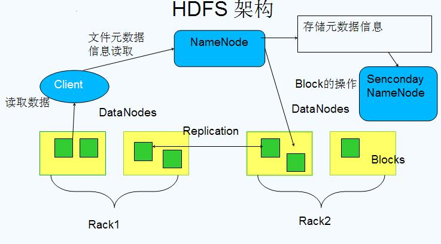

# hdfs-core

## 一、特点

- 以流式数据访问模式来存储超大文件 ，一次写多次读
- 不适合处理大量小文件

  ```
  1) HDFS 通常使用 128 MB 作为一个数据块,会保存 3 份快照在不同节点上.
  2) 当客户端提交的文件不足 128 MB 的时候,也会占用一个块的容量
     当客户端提交的文件超过 128 MB 的时候,比如 200 MB 的时候,会占用 2 个块的容量
  ```


## 二、系统

[hdfs-core 详细原理图](https://www.processon.com/view/link/56629a87e4b01db999f2f337)




### 1.NameNode 和 DataNode


```
1) 集群以 一个管理者(NameNode) 多个工作者模式运行(DataNode)

2) NameNode
  (1) 维护文件系统树及整棵树内所有的文件和目录，以文件形式保存在 NameNode 节点的本地磁盘上
  (2) 命名空间镜像文件和编辑日志文件
  (3) 记录每个文件中各个块所在的数据节点(DataNode)信息，但它并不永久保存块的位置信息，这些信息会在系统启动由数据节点(DataNode)重建

3) DataNode
  (1) 文件系统的工作节点，储存检索数据块，定期向 NameNode 发送们所存储块的列表

4) 客户端
  通过与 NameNode 和 DataNode 交互获取整个 HDFS 文件系统。
```

### 2. 高可用 HDFS HA


```
1) NameNode
  (1) 共享存储实现编辑日志的共享。
  (2) 当备用的 NameNode 接管工作之后，他将通读共享编辑日志直至末尾，以实现与互动 NameNode 的状态同步，并继续读取活动的 NameNode 写入的新记录

2) DataNode
  需要向两个 NameNode 发送数据块处理报告，因为数据块的映射信息存储在 NameNode 的内存中，而非磁盘中

3) 客户端
  需要通过特定的机制处理 NameNode 之间的实效，比如指定某个 NameNode 服务器
```

### 3. 重要配置

```
1) core-default.xml
  fs.defaultFS (fs.default.name)
    默认文件系统的名称。一个URI和权威确定文件系统实现的方案
    如 : hdfs://NameNode:8020

  file.replication
    复制因子 ，默认 1，不要修改


2) hdfs-default.xml
  dfs.replication
    默认的块复制 , 一般设置为 3

  dfs.namenode.name.dir (dfs.name.dir)
    file://${hadoop.tmp.dir}/dfs/nn
    NameNode 节点元数据目录

  dfs.datanode.data.dir (dfs.data.dir)
    file://${hadoop.tmp.dir}/dfs/dn
    DataNode 节点数据目录

  dfs.nameservices (dfs.federation.nameservices)
    以逗号分隔的名称服务
    如 Ucluster

```

### 4、接口服务

```
1) http 方式开启端口
  (1) hdfs-default.xml 配置 dfs.webhdfs.enabled 为 True(默认为)
  (2) 服务形式
      NameNode 内嵌的 Web 服务器(port 50070),提供目录服务,目录列表以 xml 或 json 格式存储
      DataNode 内嵌的 Web 服务器(port 50075),提供具体数据流形式传输


2) HttpFS 的代理服务器(具备读和写的能力),推荐使用这种方式
  (1) 提供了和 WebHDFS 一样的 HTTP 接口，因此客户端可以通过 webhdfs URI 访问这 2 类接口的了
  (2) 在规范正式定义了 WebHDFS 中使用 HTTP REST API
  (3) 一般 WEBHDFS 协议的端口运行在 (fs.defaultFS 8020) 中


3) 编程语言接口
  java 、shell、python 等，使用第二种方式访问 HDFS 文件系统，如 hdfs://NameNode:8020/user/hive

```


## 三、Hadoop IO

- [Hadoop IO 文章](http://sishuok.com/forum/blogPost/list/5963.html)

### 1、压缩

```
1) hdfs 可以对文件进行压缩，并且支持各种压缩算法，但是需要注意的是
  (1) 对大文件，不要使用不支持切分整个文件的压缩格式，因为会失去数据的本地特性，进而造成了 MapReduce 应用效率降低

2) MapReduce 中的 Map 阶段使用压缩可以提高效率
  mapreduce.map.output.compress=true
  mapreduce.map.output.compress.codec=org.apache.hadoop.io.compress.DefaultCodec

```

### 2、序列化

- 序列化(serialization): 将结构化对象转化为字节流以便在网络上传输或写到磁盘永久存储
- 反序列化(deserialization): 将字节流转回结构化对象的逆过程

```
1) 应用
  进程间的通讯和永久存储

2) 序列化在 Hadoop 中的应用
  (1) 系统多个节点的通信是通过 "远程过程调用(remote procedure call ,PRC)" 实现的
  (2) RPC 协议将消息序列化成二进制流后发到远程节点，远程节点再讲二进制流反序列化为原始信息

3) Avro 独立与编程语言的数据序列化系统 ，更多详细见 Avro 章节
  (1) Avro 模式: 通常用 JSON 编写,数据通常采用二进制格式来编码
  (2) Avro 规范: 精确定义所有实现都必须支持二进制格式
  (3) Avro 丰富的解析模式
  (4) Avro 可以用于 RPC
```


### 3、SequenceFile 和 MapFile

- http://blog.csdn.net/javaman_chen/article/details/7241087
- http://blog.csdn.net/xhh198781/article/details/7693358

```
1) 介绍
  为二进制键/值对提供了一个持久数据结构

2) 应用场景
  Hadoop 的 HDFS 和 MapReduce 子框架主要是针对大数据文件来设计的，在小文件的处理上不但效率低下，而且十分消耗内存资源(每一个小文件占用一个 Block,每一个 block 的元数据都存储在 namenode 的内存里)。
  解决办法通常是选择一个容器，将这些小文件组织起来统一存储。HDFS提供了两种类型的容器，分别是SequenceFile和MapFile。
```
